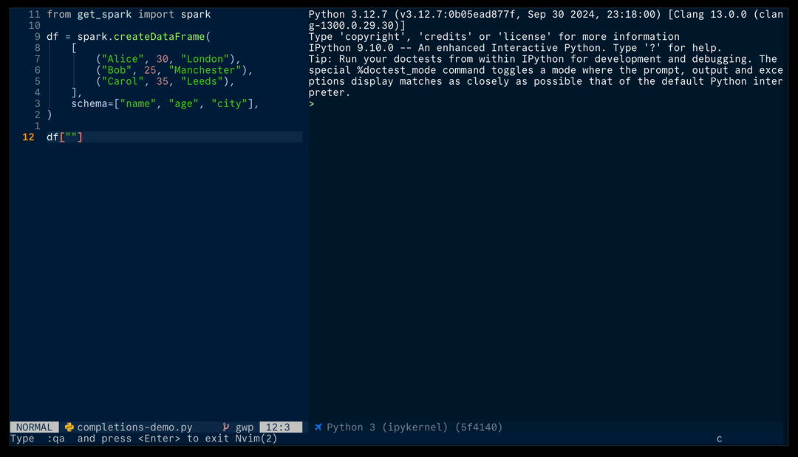

+++
title = "Customising Python autocompletions using Jet ✈️"
date = 2026-09-15
template = "post.html"
image = "after-all-why-not.jpg"
+++

> [Jet](https://github.com/wurli/jet) is a recently released Jupyter kernel
> supervisor for the terminal. This post shows one of the many cool things it
> can do.

Python language servers like [pyright](https://github.com/microsoft/pyright),
[ty](https://github.com/astral-sh/ty),
[pyrefly](https://github.com/facebook/pyrefly) etc provide completions using
_static_ code analysis. This means that they can't surface information from
your Python runtime; they only show information which can be readily inferred
from the codebase.

For example:
``` python
import pandas as pd
my_df = pd.read_csv("my_df.csv")

my_df["│
#      󱞽 Cursor here
```

It would be lovely to get column name autocompletion here, but since the
language server can't look into the contents of `my_df.csv`, in this case it
can't give us anything useful.

> Note: if you often work with unfamiliar datasets, column completions are
> *really* useful!

If you already have `my_df` available in a Python runtime though, why shouldn't
you be able to simply pass `my_df.columns` over to your completion engine?


<center></center>
<!-- {width=25%} -->

Why not indeed - IPython provides a nice API to do exactly this! And, if you're
using ipykernel via [Jet](https://github.com/wurli/jet), you can pass the
resulting completions over to any editor which speaks the language server
protocol.

## Basic completions for pyspark DataFrames

You can define custom completions for any class using the IPython
[matcher](https://ipython.readthedocs.io/en/stable/api/generated/IPython.core.completer.html#matchers)
API. IPython is actually smart enough to provide simple completions for pandas
out of the box, but currently has no special handling for Pyspark.

We can achieve a lot with only a couple of lines of code:

``` python
from pyspark.sql.dataframe import DataFrame

DataFrame._ipython_key_completions_ = lambda self: list(self.columns)
```

<details>
<summary><em>Where should I put this code?</em></summary>

<div id="user-install">Astute question.</div>

One nice option is to use your user-specific IPython config. Eagerly
importing pyspark is probably not a good idea though. Instead, you can use
IPython to check whether pyspark is loaded after each execution, and only
install the completer if it is:
``` python
# $HOME/.ipython/profile_default/startup/pyspark-completions.py
import sys

from IPython.core.completer import (
    SimpleCompletion,
    context_matcher,
)

_ip = get_ipython()


def _install_key_completions(_):
    # Classic pyspark (e.g. databricks-connect 15.x) exposes DataFrame at
    # pyspark.sql.dataframe; Spark Connect (databricks-connect 16+) returns a
    # separate pyspark.sql.connect.dataframe.DataFrame with no shared base, so
    # check whichever modules are loaded.
    for name in ("pyspark.sql.dataframe", "pyspark.sql.connect.dataframe"):
        if (m := sys.modules.get(name)) is not None:
            m.DataFrame._ipython_key_completions_ = lambda self: list(self.columns)


_ip.events.register("post_run_cell", _install_key_completions)
```
</details>



> *Note 1*: for the above gif I put the code snippet in my [user-level IPython
> config](#user-install), so it loads automatically with each session.
>
> *Note 2*: to get this in Neovim you should use
> [jet.nvim](https://github.com/wurli/jet.nvim), and maybe
> [jet.ipy](https://github.com/wurli/jet.ipy) if you want more Python features.

## Triggering completions in `DataFrame` method chains

In practice, pyspark code tends to look like this:
``` python
processed = (
    my_df.filter(F.isnotnull("id"))
    .select("foo", "bar")
    .withColumn("baz", F.coalesce("foo", "bar"))
)
```

Each of the strings in the above code refer to column names, and they're all
places where we can trigger completions. The basic approach is:

1. From the cursor position, ascend the syntax tree to determine
  * If the cursor is currently in a string
  * If the cursor is currently in a `DataFrame` method which operates on
    columns, e.g. `select()`, `filter()`, etc
  * The code for the 'root' node, e.g. `"my_df"` in the above snippet
2. Send the columns from the root `DataFrame` to the completion provider

The following code is what I'm using for this *right now*, although readers may
want to also check my [actual
config](https://github.com/wurli/dotfiles/blob/main/.config/ipython/profile_default/startup/10-pyspark-completions.py),
as this will likely evolve in the future.


``` python
import ast
import sys

from IPython.core.completer import (
    SimpleCompletion,
    context_matcher,
)

_ip = get_ipython()


_COL_METHODS = frozenset(
    {
        "agg",
        "coalesce",
        "drop",
        "filter",
        "groupBy",
        "groupby",
        "isnotnull",
        "isnull",
        "join",
        "orderBy",
        "partitionBy",
        "select",
        "sort",
        "where",
        "withColumn",
        "withColumnRenamed",
        "withColumnsRenamed",
    }
)

# Suffixes to try appending to make an incomplete snippet parseable — closes an
# unterminated string plus up to 3 levels of nested calls.
_CLOSINGS = [q + ")" * n for n in range(4) for q in ('"', "'")]


@context_matcher()
def _df_col_matcher(context):
    df_classes = tuple(
        m.DataFrame
        for name in ("pyspark.sql.dataframe", "pyspark.sql.connect.dataframe")
        if (m := sys.modules.get(name)) is not None
    )
    if not df_classes:
        return {"completions": []}

    # cursor_position is line-relative. Rebuild the snippet up to the cursor and
    # note the cursor's (lineno, col) in AST coordinates (1-indexed line).
    lines = context.full_text.split("\n")
    current_line = lines[context.cursor_line]
    col = min(context.cursor_position, len(current_line))
    snippet = "\n".join(lines[: context.cursor_line] + [current_line[:col]])
    cursor = (context.cursor_line + 1, col)
    prefix = context.token.lstrip("\"'")

    tree = None
    for closing in _CLOSINGS:
        try:
            tree = ast.parse(snippet + closing)
            break
        except SyntaxError:
            continue
    if tree is None:
        return {"completions": []}

    def has_cursor(node):
        return (
            (node.lineno, node.col_offset)
            <= cursor
            <= (node.end_lineno, node.end_col_offset)
        )

    # Innermost call first; walk outward until we find a DataFrame method.
    calls = sorted(
        (n for n in ast.walk(tree) if isinstance(n, ast.Call) and has_cursor(n)),
        key=lambda n: (n.lineno, n.col_offset),
        reverse=True,
    )

    for call in calls:
        func = call.func
        if not isinstance(func, ast.Attribute) or func.attr not in _COL_METHODS:
            continue
        if not isinstance(func.value, ast.Name):
            continue
        df = _ip.user_ns.get(func.value.id)
        if not isinstance(df, df_classes):
            continue
        return {
            "completions": [
                SimpleCompletion(text=c, type="value")
                for c in df.columns
                if c.startswith(prefix)
            ],
            "suppress": True,
        }

    return {"completions": []}


_ip.Completer.custom_matchers.append(_df_col_matcher)
```
