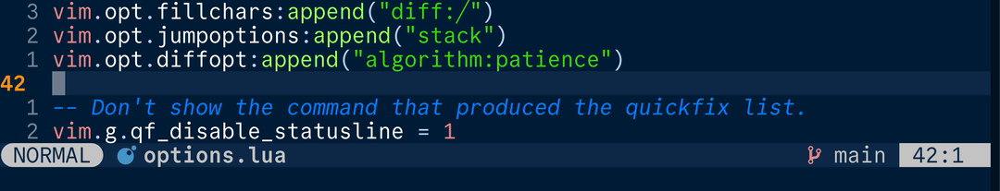
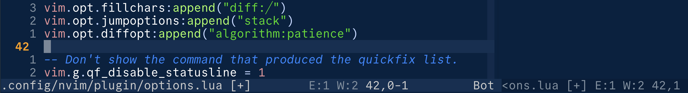
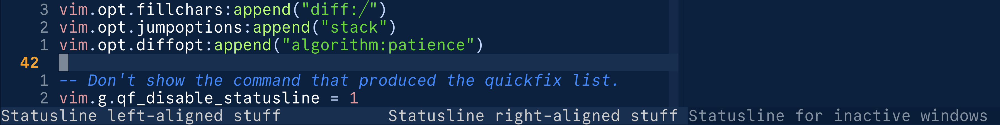
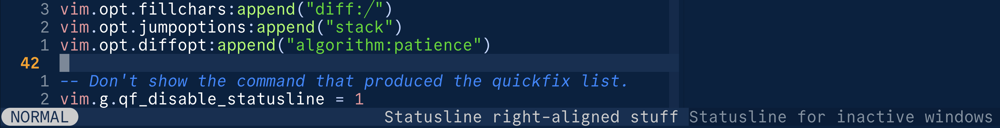

+++
title = "Roll your own Neovim statusline"
date = 2026-04-18
template = "post.html"
+++

## tl;dr

You can create a (really) nice statusline quite easily without dedicated
plugins:



## Neovim's default statusline

The unconfigured statusline looks something like this:



You get:

* The path to the current file
* A modified status indicator (`[+]` to show there are unsaved changes)
* LSP diagnostics (`E:1 W:2`)
* The cursor position (`42,0-1`)
* The position of the viewport (`Bot`, i.e. bottom of the page)

For my money this is actually a great set of defaults. But if you also spend
hours every day in this editor, you may ask yourself, *does it spark joy*?

For me, an ideal, Marie Kondo-style statusline should be:

* Fancy but understated
* Lightweight
* Hackable

This turns out to be very achievable with nvim's built-in functionality -
here's how.

## What's in a statusline?

The statusline [help page](https://neovim.io/doc/user/options/#'statusline')
says this about the statusline option:

> Contains printf-style "%" items interspersed with normal text, where
> each item has the form: <br/>
> `%-0{minwid}.{maxwid}{item}`

It also lists a bunch of options you can use as the `{item}`, although for us
it's sufficient to note only two:

| Item     | Meaning                                                                                         |
| -------  | -------                                                                                         |
| `%#Bla#` | Apply the `Bla` highlight group to anything that comes next                                     |
| `%=`     | Anything before this will be to the left of the status bar; anything after will be to the right |

## Creating a statusline using Lua

First let's create a Lua function which returns a string formatted as per the
above advice. I'm putting this in `nvim/lua` and returning it at the end of the
script - this way I can just `require()` the file from anywhere in my Neovim
config.

``` lua
-- nvim/lua/statusline.lua

return {
	render = function()
		local active_win = vim.fn.win_getid()
		local status_win = vim.g.statusline_winid

		if status_win ~= active_win then
			return "Statusline for inactive windows"
		end

		return table.concat({
			"Statusline left-aligned stuff",
			"%=", -- Left/right separator
			"Statusline right-aligned stuff",
		})
	end,
}
```

There's one more fact about statusline `{item}` options we should note from the
help docs:

> When the option starts with "%!" then it is used as an expression,
> evaluated and the result is used as the option value.  Example: <br/>
> `set statusline=%!MyStatusLine()`

We can use this, along with `v:lua`, to call our Lua function:

``` lua
-- nvim/init.lua

vim.opt.statusline = "%!v:lua.require'statusline'.render()"
```

With this setup we can now insert arbitrary components into our statusline by
including them in `render()`. You might notice that I also snuck in some
special behaviour for statuslines in non-focussed windows - you don't have to
keep this, but all the other kids are doing it.

Our statusline now looks like this:



## Setting up some highlight groups

For a *truly* fancy statusline you will probably want to define some custom
highlights. You can use preexisting ones, but IMO it's a little clearer to
define some dedicated highlight groups. You can put this code at the top of
`nvim/lua/statusline.lua`:

``` lua
local hl = function(group)
	return vim.api.nvim_get_hl(0, {
		name = group,
		link = false,
		create = false,
	})
end

local set_hl_groups = function()
	local base = hl("StatusLine")

	for group, opts in pairs({
		ModeNormal = { fg = base.bg, bg = hl("StatusLine").fg },
		ModePending = { fg = base.bg, bg = hl("Comment").fg },
		ModeVisual = { fg = base.bg, bg = hl("SpecialKey").fg },
		ModeInsert = { fg = base.bg, bg = hl("DiffAdded").fg },
		ModeCommand = { fg = base.bg, bg = hl("Number").fg },
		ModeReplace = { fg = base.bg, bg = hl("Constant").fg },
		Bold = { fg = base.fg, bg = base.bg, bold = true },
		Dim = { fg = hl("LineNr").fg, bg = base.bg },
	}) do
		group = "StatusLine" .. group
		vim.api.nvim_set_hl(0, group, opts)
		opts.fg, opts.bg = opts.bg, opts.fg
		vim.api.nvim_set_hl(0, group .. "Inverted", opts)
	end
end

-- Compile and apply our custom highlights
set_hl_groups()

-- Re-compile statusline colours when the colorscheme changes
vim.api.nvim_create_autocmd("ColorScheme", {
	group = vim.api.nvim_create_augroup("my_statusline", {}),
	desc = "Re-apply statusline highlights on colorscheme change",
	callback = set_hl_groups,
})
```

`set_hl_groups()` creates a bunch of highlight groups like `"StatusLineBold"`,
`"StatusLineBoldInverted"`, `"StatusLineModeNormal"`, etc. These reuse
attributes of existing highlight groups here - we could define our own colours,
but these wouldn't look good with every colorscheme. 

## Creating a component

``` lua
local mode_component = function()
	-- Note: termcodes \19 and \22 are ^S and ^V
	---- stylua: ignore
	local mode_settings = {
		["n"] = { name = "NORMAL", hl = "Normal" },
		["no"] = { name = "OP-PENDING", hl = "Pending" },
		["nov"] = { name = "OP-PENDING", hl = "Pending" },
		["noV"] = { name = "OP-PENDING", hl = "Pending" },
		["no\22"] = { name = "OP-PENDING", hl = "Pending" },
		["niI"] = { name = "NORMAL", hl = "Normal" },
		["niR"] = { name = "NORMAL", hl = "Normal" },
		["niV"] = { name = "NORMAL", hl = "Normal" },
		["nt"] = { name = "NORMAL", hl = "Normal" },
		["ntT"] = { name = "NORMAL", hl = "Normal" },
		["v"] = { name = "VISUAL", hl = "Visual" },
		["vs"] = { name = "VISUAL", hl = "Visual" },
		["V"] = { name = "V-LINE", hl = "Visual" },
		["Vs"] = { name = "V-LINE", hl = "Visual" },
		["\22"] = { name = "V-BLOCK", hl = "Visual" },
		["\22s"] = { name = "V-BLOCK", hl = "Visual" },
		["s"] = { name = "SELECT", hl = "Insert" },
		["S"] = { name = "S-LINE", hl = "Normal" },
		["\19"] = { name = "S-BLOCK", hl = "Normal" },
		["i"] = { name = "INSERT", hl = "Insert" },
		["ic"] = { name = "INSERT", hl = "Insert" },
		["ix"] = { name = "INSERT", hl = "Insert" },
		["R"] = { name = "REPLACE", hl = "Replace" },
		["Rc"] = { name = "REPLACE", hl = "Replace" },
		["Rx"] = { name = "REPLACE", hl = "Replace" },
		["Rv"] = { name = "V-REPLACE", hl = "Replace" },
		["Rvc"] = { name = "V-REPLACE", hl = "Replace" },
		["Rvx"] = { name = "V-REPLACE", hl = "Replace" },
		["c"] = { name = "COMMAND", hl = "Command" },
		["cv"] = { name = "EX", hl = "Command" },
		["ce"] = { name = "EX", hl = "Command" },
		["r"] = { name = "REPLACE", hl = "Normal" },
		["rm"] = { name = "MORE", hl = "Normal" },
		["r?"] = { name = "CONFIRM", hl = "Normal" },
		["!"] = { name = "SHELL", hl = "Normal" },
		["t"] = { name = "TERMINAL", hl = "Command" },
	}

	local mode = mode_settings[vim.fn.mode()] or {}

	return table.concat({
		"%#StatuslineMode" .. mode.hl .. "Inverted" .. "#",
		"%#StatuslineMode" .. mode.hl .. "#" .. mode.name,
		"%#StatuslineMode" .. mode.hl .. "Inverted" .. "#",
	})
end
```

We:
*   Get the current mode using `vim.fn.mode()`
*   Get the corresponding display name and the highlight group
*   Construct a string complete with fancy icons for a bubble effect

We can then drop this component into our `render()` function like so:

``` lua
return {
	render = function()
		local active_win = vim.fn.win_getid()
		local status_win = vim.g.statusline_winid

		if status_win ~= active_win then
			return "Statusline for inactive windows"
		end

		return table.concat({
			mode_component(), --   <- New component added here
			"%=",
			"Statusline right-aligned stuff",
		})
	end,
}
```

(Note: if you set the mode in the statusline, you might also want to `:set
noshowmode` so it doesn't get duplicated on the row below).

This gets us something like this:




## Some gotchas

**Gotcha: using buffer numbers**

If you display buffer-specific information in your statusline, use the following
code to get the buffer number:

``` lua
local statusline_bufnr = function()
	return vim.api.nvim_win_get_buf(vim.g.statusline_winid or 0)
end
```

E.g. `vim.api.nvim_buf_get_name(0)` will always get the name for the buffer
your cursor is in, but `vim.api.nvim_buf_get_name(statusline_bufnr())` will
give window-specific file names.

**Gotcha: statusline refresh**

If you use a component which updates in the background or with a slight
delay, you may find that your statusline doeesn't update, e.g. until you
start modifying text. In these cases you can use `:redrawstatus` to
trigger an update. E.g. I found I needed to do this in an autocommand to
make sure I got snappy updates from information provided by
[gitsigns.nvim](https://github.com/lewis6991/gitsigns.nvim):

``` lua
vim.api.nvim_create_autocmd("User", {
	pattern = "GitSignsUpdate",
	group = vim.api.nvim_create_augroup("statusline_git", {}),
	command = "redrawstatus",
})
```

## Final notes

This is hopefully enough for you to begin to lovingly craft your own
statusline that does exactly what *you* need and nothing more. If you want
some more inspiration you can see the actual [version I
use](https://github.com/wurli/dotfiles/blob/main/.config/nvim/lua/statusline.lua)
which includes components for the current file, Git status, etc.

