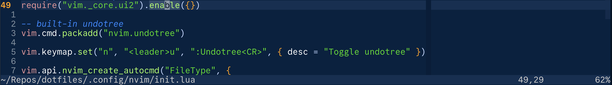

The default Neovim statusline looks like this:

With zero config you get:

*   The path to the current file (`~/Repos/dotfiles/.config/nvim/init.lua`)
*   A modified status indicator (`[+]` to show there are unsaved changes)
*   The cursor position (`49,29`)
*   The position of the viewport (`62%`)
*   As of 0.12 you also get other stuff sometimes, e.g. LSP progress messages

For my money this is actually a great set of defaults. But if you also spend
hours every day in this editor, you may ask yourself, *does it spark joy*?

I want a statusline which is:

*   Fancy but understated
*   Lightweight
*   Hackable

This turns out to be very achievable with nvim's built-in functionality only -
no plugins here. Let's get our Marie Kondo on.

